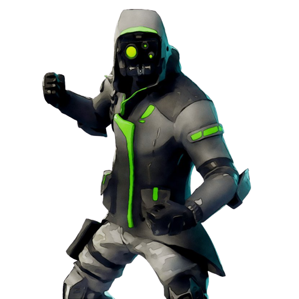
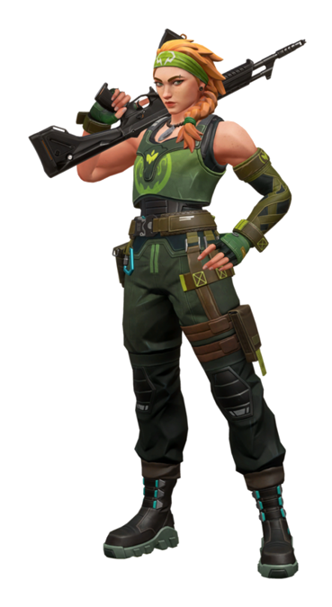
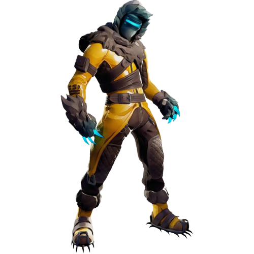
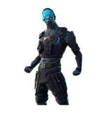
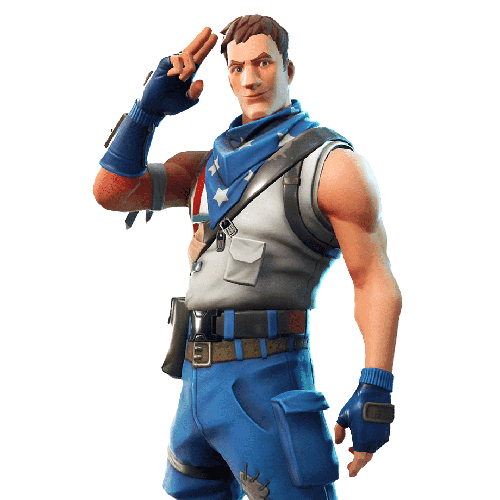
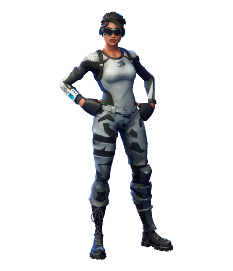

# Character

#### We have more than 30 characters in the game, each of which has its own characteristics and skills

  .png>)  (1).png>)  .png>) .png>)  .png>)    .png>) .png>)  .png>) .png>)  .png>)      .png>)  .png>)  .png>) 

### Detail NFT

<table><thead><tr><th>Name</th><th data-type="rating" data-max="5">Health Points</th><th align="center">Speed</th></tr></thead><tbody><tr><td>1. Beretta</td><td>5</td><td align="center">​10/10</td></tr><tr><td>2. Scar</td><td>5</td><td align="center">10/10</td></tr><tr><td>3. Nova</td><td>5</td><td align="center">10/10</td></tr><tr><td>4. Majesty</td><td>5</td><td align="center">10/10</td></tr><tr><td>5. Cougar</td><td>5</td><td align="center">10/10</td></tr><tr><td>6. Leon</td><td>4</td><td align="center">9/10</td></tr><tr><td>7. Riveter</td><td>5</td><td align="center">10/10</td></tr><tr><td>8. Heroin</td><td>5</td><td align="center">10/10</td></tr><tr><td>9. Mario</td><td>3</td><td align="center">8/10</td></tr><tr><td>10. Dante</td><td>3</td><td align="center">8/10</td></tr><tr><td>11. Terror</td><td>4</td><td align="center">8/10</td></tr><tr><td>12. Cortez</td><td>4</td><td align="center">8/10</td></tr><tr><td>13. Devlin</td><td>3</td><td align="center">8/10</td></tr><tr><td>14. Ultra</td><td>3</td><td align="center">10/10</td></tr><tr><td>15. Marcus</td><td>2</td><td align="center">7/10</td></tr><tr><td>16. Vanity</td><td>4</td><td align="center">7/10</td></tr><tr><td>17. Rayman</td><td>3</td><td align="center">8/10</td></tr><tr><td>18. Nathan</td><td>3</td><td align="center">8/10</td></tr><tr><td>19. Banjo</td><td>3</td><td align="center">8/10</td></tr><tr><td>20. Billy</td><td>4</td><td align="center">10/10</td></tr><tr><td>21. Xenon</td><td>3</td><td align="center">10/10</td></tr><tr><td>22. Vixen</td><td>3</td><td align="center">9/10</td></tr><tr><td>23. Countess</td><td>4</td><td align="center">10/10</td></tr><tr><td>24. Widow</td><td>3</td><td align="center">9/10</td></tr><tr><td>25. Akira</td><td>3</td><td align="center">8/10</td></tr><tr><td>26. Jack</td><td>2</td><td align="center">9/10</td></tr><tr><td>27. Siren</td><td>2</td><td align="center">9/10</td></tr><tr><td>28. Harlem</td><td>5</td><td align="center">10/10</td></tr><tr><td>29. Riveter</td><td>3</td><td align="center">8/10</td></tr><tr><td>30. Sora</td><td>3</td><td align="center">8/10</td></tr></tbody></table>

##


The final design of the game may change slightly with the photo!

