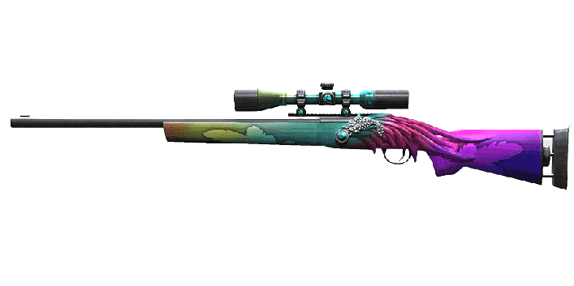
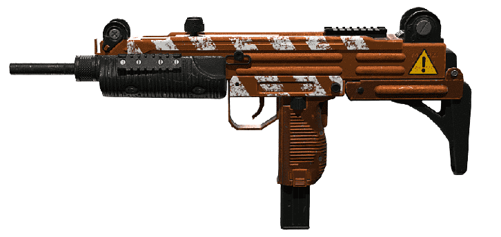
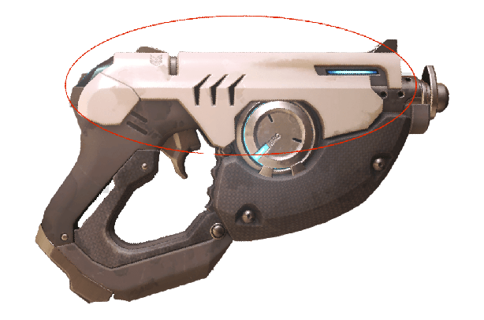
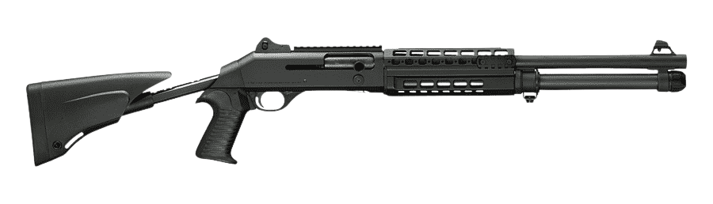

# Gun NFT

#### There are more than twenty NFT guns in the game and each has its own power and features

.png>) .png>) .png>)   .png>) .png>) .png>)   .png>)  .png>) .png>)  .png) .png>)  .png>)  

### Detail NFT

| Name                                     | Cartridge | Power | Gun magazine |
| ---------------------------------------- | :-------: | :---: | :----------: |
| 1.​ Mini Uzi                             |     25    |  4/10 |       5      |
| 2. G36C                                  |     30    |  4/10 |       6      |
| 3. G3A4                                  |     30    |  4/10 |       5      |
| 4. UMP45                                 |     30    |  4/10 |       7      |
| 5. R700                                  |     20    |  8/10 |       4      |
| 6. Galil                                 |     30    |  5/10 |       5      |
| 7. Steyr                                 |     25    |  4/10 |       5      |
| 8. M240 SAW                              |     50    |  3/10 |       3      |
| 9. M4A1                                  |     25    |  3/10 |       5      |
| 10. K10                                  |     20    |  3/10 |       6      |
| 11. Kriss35                              |     20    |  4/10 |       5      |
| 12. P228                                 |     10    |  3/10 |       3      |
| 13. MP7                                  |     25    |  5/10 |       5      |
| 14<mark style="color:blue;">.</mark> M21 |     10    |  9/10 |       5      |
| 15. Famas                                |     20    |  4/10 |       6      |
| 16. M14                                  |     8     |  8/10 |       4      |
| 17. M9                                   |     5     |  3/10 |       5      |
| 18. Mini Uzi-R                           |     25    |  4/10 |       5      |
| 19. Mini Uzi-X                           |     35    |  4/10 |       6      |
| 20. USP45                                |     10    |  4/10 |       4      |
| 21. Shotgun                              |     10    |  7/10 |       5      |


The final design of the game may change slightly with the photo!

